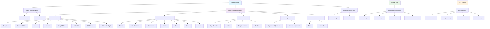

```mermaid
graph TD
    A[Main Program] --> B[Image Loading System]
    A --> C[Image Processing System]
    A --> D[Image Saving System]

    B --> B1[Load Image]
    B --> B2[Load Check]

    C --> C1[Basic Filters]
    C --> C2[Geometric Transformations]
    C --> C3[Special Effects]
    C --> C4[Color Adjustments]
    C --> C5[Blur & Distortion Effects]

    C1 --> C1_1[GrayScale]
    C1 --> C1_2[BlackAndWhite]
    C1 --> C1_3[Invert]
    C1 --> C1_4[Infrared]
    C1 --> C1_5[Purple Filter]
    C1 --> C1_6[Retro TV]
    C1 --> C1_7[Oil Painting]
    C1 --> C1_8[Natural Sunlight]

    C2 --> C2_1[Rotate]
    C2 --> C2_2[Flip Horizontal]
    C2 --> C2_3[Flip Vertical]
    C2 --> C2_4[Resize]
    C2 --> C2_5[Crop]
    C2 --> C2_6[Skew]
    C2 --> C2_7[Frame]

    C3 --> C3_1[Edge Detection]
    C3 --> C3_2[Swirl]
    C3 --> C3_3[Wavy Distortion]
    C3 --> C3_4[Pixelize]

    C4 --> C4_1[Brightness Adjustment]
    C4 --> C4_2[Contrast Adjustment]

    C5 --> C5_1[Blur]
    C5 --> C5_2[Motion Blur]

    D --> D1[Save Image]
    D --> D2[Save Check]

    E[Image Class] --> F[Core Image Operations]
    F --> F1[Load Image]
    F --> F2[Save Image]
    F --> F3[Pixel Access]
    F --> F4[Memory Management]

    G[GUI System] --> H[User Interface]
    H --> H1[Main Window]
    H --> H2[Image Display]
    H --> H3[Control Panel]
    H --> H4[File Dialogs]

    style A fill:#e1f5fe
    style C fill:#f3e5f5
    style E fill:#e8f5e8
    style G fill:#fff3e0
```
