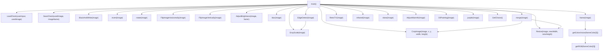

```mermaid
flowchart TD
    A["main()"]
    A --> B1["LoadCheck(userInput, usedImage)"]
    A --> B2["SaveCheck(usedImage, imageName)"]
    A --> B3["GrayScale(image)"]
    A --> B4["BlackAndWhite(image)"]
    A --> B5["invert(image)"]
    A --> B6["rotate(image)"]
    A --> B7["FlipImageHorizontally(image)"]
    A --> B8["FlipImageVertically(image)"]
    A --> B9["CropImage(image, x, y, width, height)"]
    A --> B10["AdjustBrightness(image, factor)"]
    A --> B11["blur(image)"]
    A --> B12["frame(image)"]
    A --> B13["Resize(image, newWidth, newHeight)"]
    A --> B14["merge(image)"]
    A --> B15["EdgeDetect(image)"]
    A --> B16["RetroTV(image)"]
    A --> B17["infrared(image)"]
    A --> B18["skew(image)"]
    A --> B19["AdjustWarmth(image)"]
    A --> B20["OilPainting(image)"]
    A --> B21["purple(image)"]
    A --> B22["GetChoice()"]

    B12 --> C1["getColorchoice(frameColor[3])"]
    C1 --> C2["getRGB(frameColor[3])"]

    B14 --> B9
    B14 --> B13

    B15 --> B3
```
